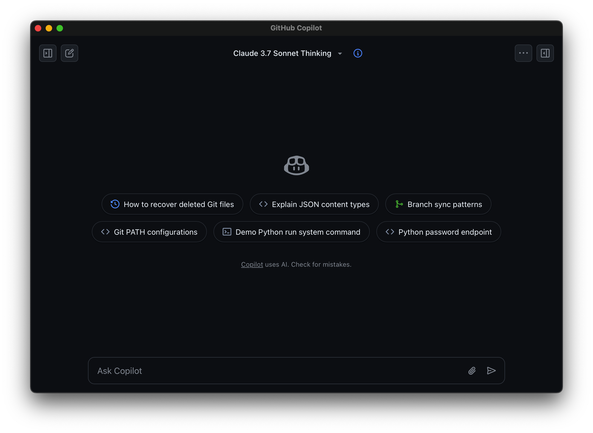

# GitHub Copilot App

A simple macOS application that provides a clean wrapper for GitHub Copilot's web interface.

## Screenshot

## Features

- Clean, distraction-free interface focused on the GitHub Copilot conversation
- Native macOS app experience
- Automatic UI cleanup to remove unnecessary elements
- Lightweight wrapper around the GitHub Copilot web interface

## Requirements

- macOS 15.0 or later
- Xcode 16.0 or later for development

## Installation

1. Clone this repository
2. Open the project in Xcode
3. Build and run the application

## Usage

After launching the app, you'll need to sign in with your GitHub account that has GitHub Copilot access. The app will automatically clean up the interface to focus on the chat experience.

## License

This project is available under the MIT License. See the LICENSE file for more information.

## Disclaimer

This is an unofficial wrapper application and is not affiliated with GitHub or Microsoft.
